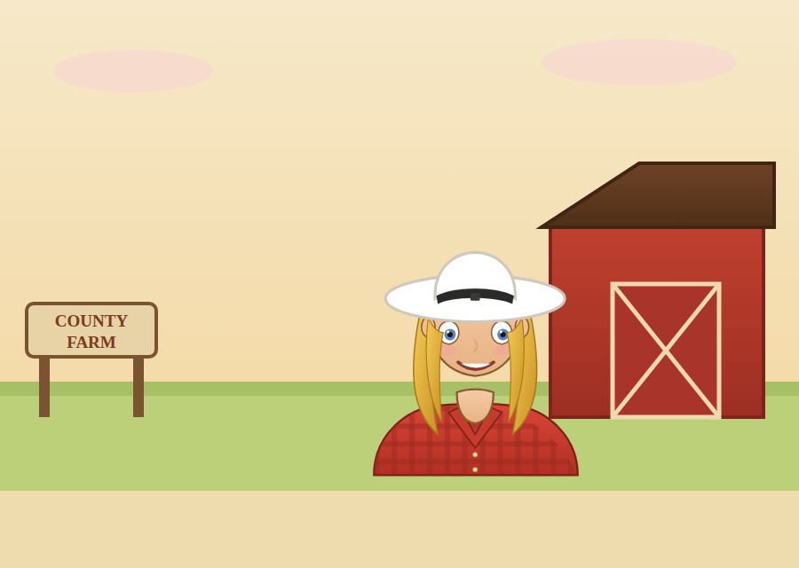

# 11. Connections (Social System)

> The player already builds a **physical** network of connection lines (§5).
> **Connections** is the *human* network layered on top: **Business**, **Love**,
> and **Family** relationships that grant land, sponsorships, morale, and story.
> Where §5 moves goods, §11 moves *favor* — and favor buys things money can't.

Every Connection has a **Relationship meter** (0–100) with named tiers:

| Tier | Range | Feel |
|------|:-----:|------|
| Stranger | 0–19 | No benefits yet |
| Acquaintance | 20–44 | Small perks unlock |
| Partner | 45–74 | Core benefits |
| Trusted | 75–94 | Strong benefits |
| Bonded | 95–100 | Best benefit + unique event |

Relationship rises through **interactions** (trade, gifts, favors, time) and
**decays slowly** if neglected (−0.2/day above tier Acquaintance). See §11.5 for
the formula.

---

## 11.1 Business Connections

You cultivate relationships with **companies** — the AI corporations (§10) plus
neutral **sponsor brands** (flavor firms like *AgriGiant*, *RustCo Fuels*,
*Verdant Organics*). Business Connections are **many** (you can hold several at
once) and they unlock three benefit families:

### A) Sponsorship — "wear their colors"
At **Partner** tier a company offers a **sponsorship deal**: you repaint your
HQ, buildings, and connection lines in **their livery (colors + logo)** in
exchange for perks.

| Sponsorship gives | In exchange for |
|-------------------|-----------------|
| Passive **sponsorship income** (\$/day, scales with your footprint) | Your reputation is **tied to theirs** — if their stock crashes, yours dips too |
| A **market perk** (e.g., −fees, or +price on their resource) | You may only wear **one company's colors at a time** (exclusive) |
| Cosmetic **livery** across your empire on the map | Breaking the deal early costs a **reputation hit** with that firm |

> Wearing a sponsor's colors is a **visible commitment** — the whole map
> recolors to their palette. It's lucrative but couples your fate to a partner
> you don't fully control (a deliberate risk/reward, and a hook for the
> competitor/takeover systems in §10).

### B) Plots — land through relationships
At higher tiers, business partners **open up land** you couldn't otherwise get:

| Tier | Plot benefit |
|------|--------------|
| Acquaintance | **First right of refusal** on a neutral hex before it goes to auction (§2.9) |
| Partner | Buy partner‑adjacent hexes at **−25% acquisition cost** |
| Trusted | Partner **grants a plot** (a hex deeded to you) once per relationship |
| Bonded | Access to a **premium hex** (high yield / rare terrain) reserved for close allies |

This makes Business Connections a **third expansion path** alongside cash
purchase and takeover: *expand by being liked.*

### C) Perks — soft advantages
| Perk | Source tier | Effect |
|------|:-----------:|--------|
| Bulk contract | Partner | Guaranteed buyer for one resource at a stable price (anti‑self‑crash) |
| Market whisper | Partner | Early hint on one upcoming price move (mini‑Forecast) |
| Shared logistics | Trusted | Use a partner's hub → −1 effective hop on nearby hexes |
| Tech exchange | Trusted | −15% RP on one shared node |
| Bailout line | Bonded | One emergency low‑interest loan when near bankruptcy |

### Sponsor Brand Table (examples)

| Brand | Colors (livery) | Signature perk | Personality tie‑in |
|-------|-----------------|----------------|--------------------|
| **AgriGiant** | Green / gold | +8% crop price | Economic |
| **RustCo Fuels** | Red / black | −20% fuel/refinery upkeep | Aggressive |
| **Verdant Organics** | Teal / cream | +eco‑subsidy, −pollution levy | Eco‑Friendly |
| **Blue Ridge Rail** | Navy / silver | −15% rail build cost | Opportunistic |
| **Sunbelt Trading Co.** | Orange / white | −0.25% market fees | Chaotic |

Building a Business Connection: **trade with them, fulfill their contracts,
avoid undercutting their resource, and gift capital.** Betrayals (dumping their
resource, buying their shares hostilely) tank the meter fast.

---

## 11.2 Love Connection (exactly one)

The Love Connection is **strictly singular** — you may court and commit to
**one** person at a time, ever. This is a deliberate design choice: it makes the
romance meaningful rather than a stat farm.

### Courtship flow

```
MEET  ──▶  COURT  ──▶  COMMIT  ──▶  (becomes FAMILY, §11.3)
 │           │            │
candidates  build       propose at
appear at   Affection    Bonded tier
town/market via gifts,
& events    dates, time
```

- **Meet:** romance candidates appear at the **Town/Market hub**, seasonal
  **festivals** (Appendix G), and certain positive events. A small, curated cast
  (3–5 candidates) so each feels authored.
- **Court:** raise an **Affection meter** (same 0–100 tiers as §11.0) via:
  - **Gifts** (a candidate has liked/loved gift types — e.g., the farm girl
    loves fresh Crops & Lumber furniture; dislikes Crude/pollution).
  - **Dates** (spend an evening — small cash/time cost, affection gain).
  - **Time** (passive small gain when you interact regularly).
- **Commit:** at **Bonded (95+)** you may **propose**. Acceptance converts the
  Love Connection into a **Family Connection** (§11.3). The Love slot is then
  **locked to that person** — no parallel romances.

### Love meter effects (pre‑marriage)
| Affection tier | Effect |
|:--------------:|--------|
| Acquaintance | +2% HQ morale aura (you're happier) |
| Partner | Occasional gift of resources from your sweetheart |
| Trusted | +1 date‑night morale buff to workers ("boss is in a good mood") |
| Bonded | Proposal unlocked |

> **One person, on purpose.** There is exactly **one** Love Connection slot. You
> can *change* who occupies it before marriage (breakups happen, with a morale
> penalty), but never hold two at once.

---

## 11.3 Family Connection — The Wife

When you marry your Love Connection, they become your **Family** — the **Wife**
(the spouse NPC). She's not a menu entry; she **moves onto your Home Hex** (the
HQ hex gains a **Farmhouse**) and becomes an active presence in the sim.

### Character reference — "Della," the farmer's wife



*Rendered from a self‑contained SVG model → PNG (see
[`assets/wife-character.html`](assets/wife-character.html)). The **same model
powers the playable prototype**, where you can actually talk to her —
[▶ play it](https://claude.ai/code/artifact/500a9dbc-4568-4654-8693-ab83c6d6cd4b).*

| Attribute | Design |
|-----------|--------|
| **Name** | Della (default; player‑renamable) |
| **Look** | White cowboy hat w/ black band · blonde wavy bob · red plaid tied shirt · denim shorts + brown belt & gold buckle · confident hand‑on‑hip stance |
| **Setting** | The farm — red barn, silo, hay, chickens, "COUNTY FARM" sign |
| **Vibe** | Warm, capable, a little sassy; the heart of the homestead |
| **Liked gifts** | Fresh Crops, Meat, Lumber furniture (Goods), flowers |
| **Disliked gifts** | Crude Oil, anything that raises pollution near home |

### Family (Wife) benefits

The Wife is a **standing bonus generator** and the emotional anchor of the run:

| Benefit | Effect | Notes |
|---------|--------|-------|
| **Home‑cooked morale** | +8% worker morale aura empire‑wide (stacks w/ HQ aura §4.6) | She "feeds the crew" |
| **Homestead hand** | **Auto‑runs one farm hex** at 100% staffing without workers | Frees 3–5 workers |
| **Steady heart** | Halves the **morale hit** from disasters (§9) | Anti‑worker‑collapse (§12) |
| **Second opinion** | One free **market whisper**/season (mini‑Forecast) | She reads the almanac |
| **Anniversary** | Seasonal **anniversary event**: +cash gift or +RP if you celebrate | Miss it → small morale dip |
| **Home Hex glow** | Home Hex gains +pollution soak & a cozy cosmetic | Encourages a clean HQ |

### Family formula (morale aura)
```
FamilyMoraleBonus = 0.08 × WifeHappiness           # WifeHappiness ∈ [0,1]
WifeHappiness   = clamp( 0.5
                       + 0.25×(giftsThisSeason≥1)
                       + 0.15×(homeHexPollution < 20)     # clean home
                       + 0.10×(anniversaryCelebrated)
                       − 0.20×(neglectDays/28) , 0, 1 )
```
A neglected or pollution‑choked home lowers `WifeHappiness`, shrinking the aura —
so the Family bonus **rewards keeping your home hex clean and attentive**, tying
the cozy layer back into the pollution system.

### Family story beats (optional, cozy)
| Beat | Trigger | Payoff |
|------|---------|--------|
| **Housewarming** | Marriage | One‑time cash & morale boost |
| **Anniversaries** | Every year | Recurring gift event |
| **Heirs** *(opt‑in)* | Late game | A child NPC → **Legacy Perk** carries into New Game+ (Appendix G) |
| **Golden years** | On win | Ending vignette on the homestead |

---

## 11.4 Connections UI

A dedicated **Connections** panel (tabbed with the Market), plus small
relationship pips on the map for connected hexes/corps.

```
┌────────────────────────── CONNECTIONS ──────────────────────────┐
│  [ BUSINESS ]   [ LOVE ]   [ FAMILY ]                            │
├──────────────────────────────────────────────────────────────────┤
│ BUSINESS                                                        │
│  AgriGiant     ▰▰▰▰▰▰▰░░░  Trusted   [Sponsor: wear GREEN/GOLD] │
│    perks: +8% crop price · plot grant available ✓               │
│  RustCo Fuels  ▰▰▰▰░░░░░░  Partner    [Contract: sell Fuel @34] │
│  Verdant Org.  ▰▰░░░░░░░░  Acquaint.  [Gift capital ▸]           │
├──────────────────────────────────────────────────────────────────┤
│ LOVE  (1 slot)                                                  │
│  ❤ Della       ▰▰▰▰▰▰▰▰▰▰  BONDED     [ Propose 💍 ]             │
│    likes: Crops, Furniture · dislikes: Crude                    │
├──────────────────────────────────────────────────────────────────┤
│ FAMILY                                                          │
│  💍 Della (Wife) — Home Hex #12  ·  Happiness ▰▰▰▰▰▰▰▰░░ 82%     │
│    +8% morale aura · auto‑runs Farm #12 · anniversary in 6 d 🎉  │
│    [ Give gift ▾ ]   [ Celebrate ]   [ Rename ]                 │
└──────────────────────────────────────────────────────────────────┘
```

---

## 11.5 Relationship Formula (all connection types)

```
Relationship_t = clamp(
    Relationship_{t−1}
  + Σ interactions:
      trade favor      +0.5 per profitable deal with them (business)
      gift             +giftScore (liked +6, loved +12, disliked −8)
      date/celebrate   +8 (love/family)
      contract met     +4 (business)
  − decay:
      0.2/day if tier ≥ Acquaintance and no interaction in 7+ days
  − betrayal:
      −25 dump their resource / hostile share buy (business)
      −40 pursue another romance (breakup, love)
  , 0, 100)

tier = band(Relationship)     # per §11.0 table
```

Benefits gate on **tier thresholds**; sponsorship income and the Wife's aura
scale continuously with the underlying meter.

---

## 11.6 How Connections Touch Every Other System

| System | Connection interaction |
|--------|------------------------|
| **Hexes (§2)** | Business plots grant/discount land; Home Hex hosts the Wife |
| **Buildings (§4)** | Wife auto‑runs a farm; sponsor livery recolors buildings |
| **Economy (§6)** | Sponsor contracts stabilize prices; business perks cut fees |
| **Progression (§8)** | Tech‑exchange perks discount RP; heirs → Legacy Perks |
| **Events (§9)** | Wife halves disaster morale hits; sponsor stock crash hurts you |
| **AI Competitors (§10)** | AI corps *are* your business connections — befriend or betray |
| **Win/Loss (§12)** | Family aura guards against worker collapse; sponsor ties can enable/deter takeovers |

> **Design intent:** Connections is the "soft" mirror of the "hard" logistics
> game. The line network (§5) is who you *ship* to; the Connection network
> (§11) is who you *trust*. Master players weave both.

---
[← AI Competitors](10-ai-competitors.md) · [Next: Win & Loss Conditions →](12-win-loss.md)
